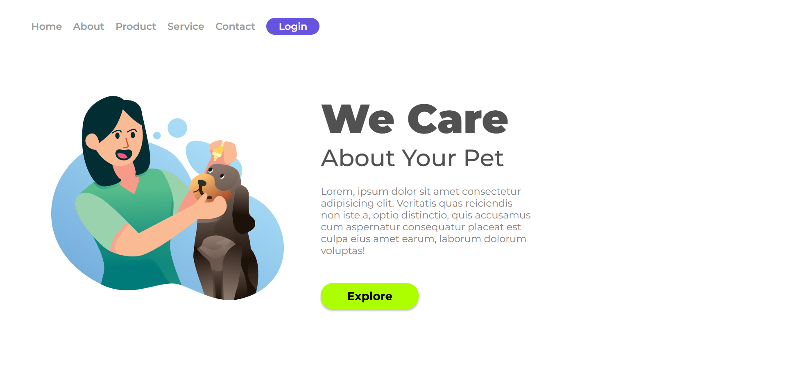
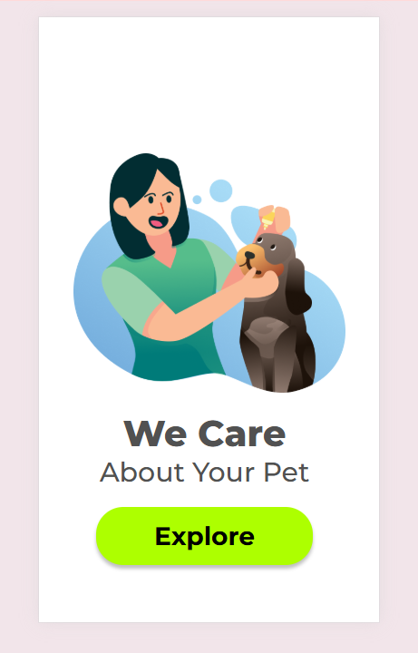

# 🐕 Project Pet

Uma aplicação de uma tela inicial para um pet shop, utilizando **HTML5** e **CSS3**.

<br>

## 📸 Demonstração

### Página inicial


### Responsividade para celular


<br>

## 🚀 Funcionalidades

- 📱 Filtra as funcionalidades
- 🛒 Cards de produtos com **nome, preço, descrição e botão de detalhes**
- 🎨 Layout e estilizado com CSS moderno
- ⚡ Interatividade com JavaScript (exibição dinâmica dos produtos)

 <br>

 ## 🛠️ Tecnologias utilizadas

- **HTML5** → estrutura da aplicação  
- **CSS3** → estilização e responsividade  
- **JavaScript** → manipulação do DOM e interatividade

<br>

## 📂 Estrutura do projeto

```bash
📦 techstore
 ┣ 📂 assets        # Imagens e ícones
 ┣ 📜 index.html    # Página principal
 ┣ 📜 style.css     # Estilos
 ┣ 📜 script.js     # Lógica JS
 ┗ 📜 README.md     # Documentação do projeto

